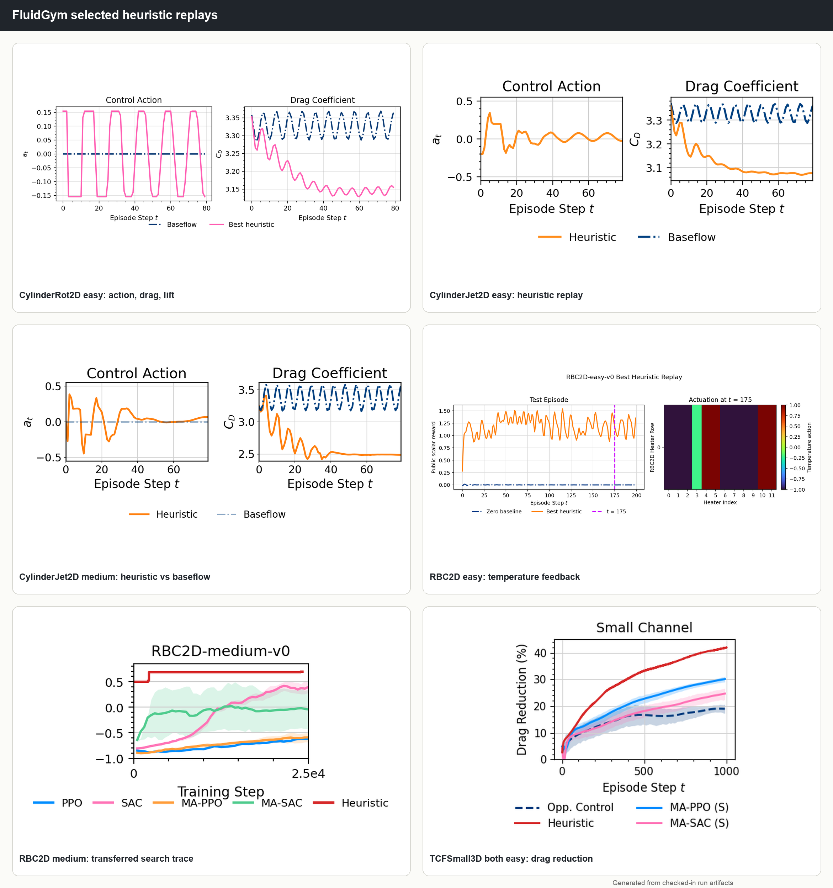
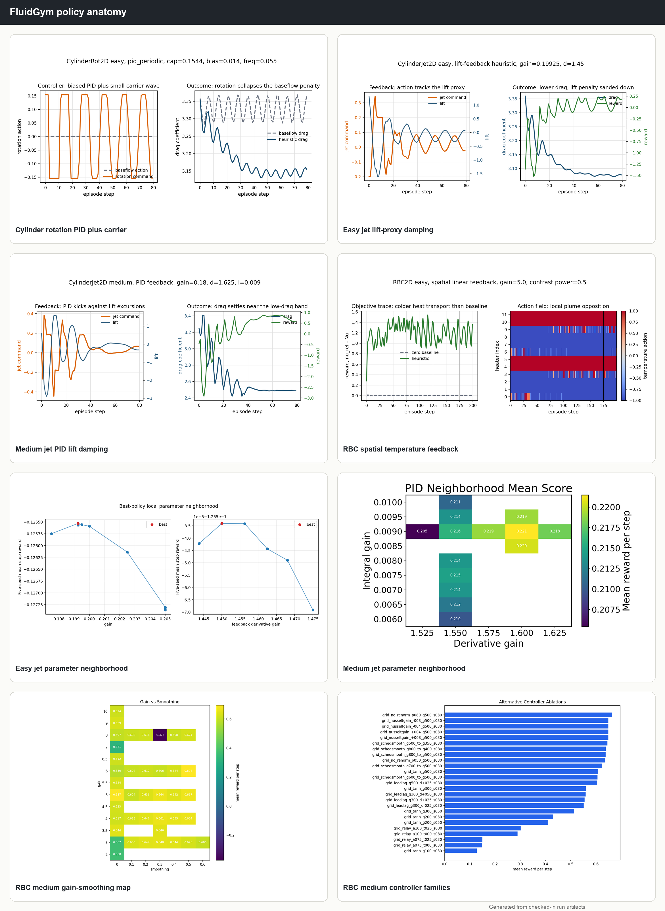
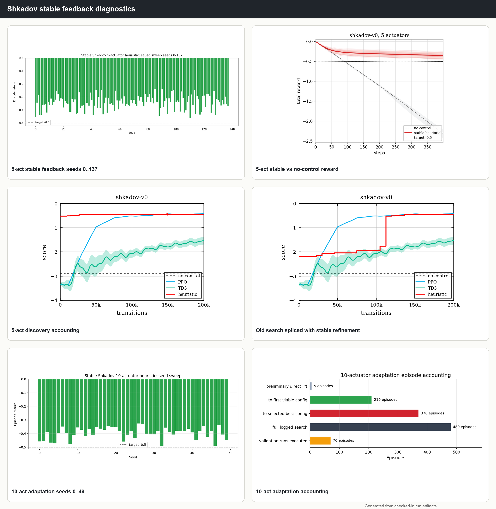

# Heuristic Learning for Fluid Dynamics: A Case Study

<video controls muted loop playsinline width="100%" src="../fluidgym_policy_videos/composites/tcf_small_3d_both_easy__policy_rows.mp4"></video>

I have been circling the same problem for years: optimization in fluid dynamics is brutally expensive, strangely addictive, and full of methods that look profound until you count the solver calls.

My first paper lived there too. In 2019, with Jonathan Viquerat, Jean Rabault, Aurelien Larcher, Alexander Kuhnle, and Elie Hachem, we wrote a review of deep reinforcement learning for fluid mechanics.[^drl-review] Around the same time, Rabault et al. had shown that a neural policy trained with PPO could discover an active-control strategy for the classic cylinder wake problem at `Re=100`.[^rabault-cylinder]

That was the beginning of a small gold rush. Cylinder wakes, shape optimization, thermal convection, turbulent channel flow, sloshing tanks, falling films. If a fluid problem had an actuator and a reward, someone eventually tried to feed it to DRL.

I took a detour after that. Startup. Product. Customers. The usual graduate-school avoidance behavior, only with invoices.

Then I came back to research in February 2024 for my PhD. My current subject is graph neural networks for predicting physics on unstructured meshes. It sits right next to optimization.

If you can predict a flow cheaply, you can optimize over it. If you can optimize over it, you can control it. If you can control it, you can start doing the dangerous thing: asking whether the agent understands the physics, or whether it has just found a very expensive way to press the same button every 17 time steps.

## The Surrogate Detour

With Jonathan Viquerat, one of my PhD advisers, I started revisiting old reinforcement-learning ideas for fluid dynamics.[^jonathan]

The obvious idea was to replace the usual multilayer-perceptron policy with a graph neural network. Fluid domains are meshes. Graphs live on meshes. Nice story. Clean slides. The kind of idea that walks into a grant proposal wearing a tie.

The problem: it didn't work well enough to be today's story.

The next idea was more ambitious. Since simulation time usually dominates these workflows, often above 95% of total compute in a control or design loop, why keep the solver in the loop at all? Replace the finite-element or finite-volume solver with a graph neural surrogate. Let the model predict the velocity and pressure fields. Use those fields to compute drag, lift, heat flux, wall stress, or whatever the optimizer needs.

That idea is still alive. It is also hard.

The easy version is making a surrogate stable for a few steps. The hard version is making it stable enough, calibrated enough, and physically honest enough that an optimizer can't exploit it like a bad contract clause.

I now think many physics surrogates are being judged with the wrong ruler. Field error is useful, but it is a weak proxy for optimization value. If the task is shape optimization, the question should be: does the surrogate choose good shapes after CFD validation? If the task is flow control, the question should be: does it choose good actions under the real simulator? A beautiful pressure field with the wrong drag ranking is a decorative lie.

Take a simple shape-optimization problem. Modify an object to increase lift and reduce drag, basically push it toward an airfoil-like shape. Viquerat et al. showed direct shape optimization through DRL in 2019.[^shape-opt]

In a toy version of that setup, a PPO algorithm coupled to a simple finite-element solver can find good shapes. A very basic surrogate that predicts only drag and lift from the shape can also find good shapes.

<video controls muted loop playsinline width="100%" src="../fluidgym_policy_videos/composites/cylinder_jet_2d_easy__policy_rows.mp4"></video>

A larger GNN that predicts full velocity and pressure over multiple steps can look more sophisticated and still lose the decision. It spends its capacity reconstructing fields while the optimizer only needs the right physical quantities, in the right order, with honest uncertainty.

This was already a useful crack in the wall. Maybe the winning object in some optimization loops is a small, interpretable decision rule rather than another giant differentiable machine.

## Then Codex Got Annoyingly Good

By the time I was running the last experiments around these subjects, Codex had crossed a threshold.

It could run most of the experimental loop by itself. I gave it hardware, a markdown protocol, a reproduction command, and a memory file describing what had worked and failed. It would write policies, run fixed-seed evaluations, update plots, simplify bad branches, and keep going.

That changed the shape of the question.

The original thought was: maybe Codex can run the optimization process. Let it decide the next shape to test.

Then I read Jiayi Weng's *Learning Beyond Gradients* post.[^learning-beyond-gradients] The core idea hit hard because it named something that had been sitting in front of us: hand-written heuristics were historically limited by human maintenance cost. A person can write a PID controller. A person can write 5 variations. A person gets bored somewhere around the 47th failed ablation and starts pretending the plot is fine.

A coding agent doesn't get bored. It can keep a ledger.

That makes heuristic learning plausible again. A heuristic here means a programmatic policy: explicit logic, computations, thresholds, filters, memory, rollouts, and tests. The protocol bars neural-network training, backpropagation, and hidden weights except small fitted proxies when explicitly allowed.

This had a pleasing side effect. It reminded me of my first competitive-programming years on Codingame: read the state, write a rule, watch it fail, patch it, delete half the patch, try again. Science, but with more Reynolds numbers and fewer leaderboard usernames.

## The Experiment

We tested the idea on two families of environments where DRL agents are normally trained for fluid control:

- `FluidGym`, our PyTorch benchmark for large-scale active flow control.
- `Beacon`, a lightweight benchmark suite by Viquerat, Meliga, Jeken, and Hachem.[^beacon]

The setup was intentionally restrictive. Codex got the same kind of interface a DRL agent gets: observations, rewards, actions, public `info`, and fixed-seed rollouts. It could write code. It could run experiments. It could inspect its own logs and plots. It could maintain memory files. It could simplify controllers.

It could not train a neural policy. It could not inspect private solver state. It could not load baseline checkpoints. It could not silently move the goalposts.

The question was simple enough to be dangerous:

Can a coding agent build interpretable control heuristics for fluid dynamics?

Then the real questions arrived:

1. Can such heuristics beat DRL baselines on at least some cases?
2. Can a heuristic transfer from an easier case to a harder one?
3. Does the solution remain stable outside the exact search conditions?
4. Does the final rule encode anything recognizable as physics?
5. Are some LLMs better than others at this kind of work?

<figure>
  
  <figcaption>Selected FluidGym replay plots from local run artifacts.</figcaption>
</figure>

## The Cases

The cases were deliberately mixed. Some are low-dimensional and almost toy-like. Others are 3D, spatially distributed, and expensive enough to punish stupid search.

`CylinderJet2D` and `CylinderRot2D` control vortex shedding behind a cylinder. The jet case uses synthetic jets; the rotation case spins the cylinder wall. Easy corresponds to `Re=100`; medium uses `Re=250`.

`RBC2D` is Rayleigh-Benard convection. A hot lower wall, a cold upper wall, buoyancy, plumes, recirculation, heat transport. The controller locally modifies bottom-wall heating. Easy uses `Ra=8e4`; medium uses `Ra=4e5`.

`TCFSmall3D-both-easy` is turbulent channel flow with both-wall actuation at friction Reynolds number `Re_tau=180`. The policy sees spatial wall information and must reduce drag without turning the wall into a very expensive random-number generator.

`Shkadov` is a falling-film instability problem. The agent actuates jets to damp film-height deviations downstream. It is a wonderful benchmark because delayed feedback matters. If the controller reacts to what it sees right now, it is often already late.

`Rayleigh`, `Mixing`, `Lorenz`, `Burgers`, `Sloshing`, and `Vortex` come from Beacon. They span convection suppression, passive-scalar mixing, attractor locking, one-dimensional disturbance suppression, tank acceleration, and vortex-induced oscillator control.

It is a good zoo. Some animals bite, some just look guilty.

## The Answer, First

Yes, Codex found interpretable heuristics. Every time.

That alone is a useful result. The final policies are small programs: PID-like feedback, mean-free spatial laws, low-mode Fourier controllers, delayed shape feedback, phase schedules, threshold automata.

The stronger result is that some of these policies are competitive with DRL.

<figure>
  
  <figcaption>Main local score comparison across FluidGym and Beacon. Protocols differ by case, so read the per-case notes before treating any single row as universal.</figcaption>
</figure>

The clean FluidGym wins are `RBC2D-easy` and `TCFSmall3D-both-easy`.

For `RBC2D-easy`, the running-best Codex score in the aggregate table is `1.2100` at `38,072` environment steps. The stricter 5-seed held-out mean in the report is `1.1093`. Both are above the extracted DRL references in the local comparison bundle.

For `TCFSmall3D-both-easy`, the best mean step reward is `0.3068` at `92,800` steps. The extracted MA-PPO reference is `0.2236`, and MA-SAC is `0.1964`. A one-episode diagnostic reports `30.26%` mean drag reduction and `41.93%` final drag reduction.

The cylinder cases are good and uneven. `CylinderJet2D-medium` reaches `0.2433`, close to the D-MPC-level reference in the local report, but the extracted SAC curve remains ahead at `0.3404`. `CylinderJet2D-easy` improves drag but lags the best SAC reward.

Beacon is split in the useful way. `Lorenz` scores `477/500`, beating the extracted PPO and DQN references. `Burgers` beats PPO and TD3 in the local bundle. `Vortex` reaches `62.4213`, above the extracted PPO curve near `56.56`, but still below the manually chosen target of `100`. `Rayleigh` gets close to PPO and TD3 but does not clear the `-100` target. `Mixing` remains the bad case: the best valid wall-action policy is around `-7.4252`; the much better `-1.2969` run edits simulator concentration state and belongs in the invalid pile.

`Shkadov` is the strongest transfer and stability story. The stable delayed-feedback law clears the `-0.5` target on `50/50` seeds, then on `138/138` seeds. The 10-actuator adaptation clears `50/50` seeds too.

That matters. A policy that wins one seed is a screenshot. A policy that wins 138 random resets starts looking like a controller.

## Sample Efficiency

<figure>
  
  <figcaption>Sample-efficiency comparison. Codex policies often reach useful behavior in tens of thousands of environment steps where DRL curves use hundreds of thousands or more.</figcaption>
</figure>

The sample-efficiency result is probably the most uncomfortable part for neural-policy habits.

The heuristics often use far fewer environment steps than DRL. The reason is boring and powerful: the search space is tiny once the agent guesses the right controller family.

A DRL policy starts with thousands or millions of parameters and must discover signal processing, memory, geometry, and action scaling through reward. A heuristic search can write those structures directly:

- "Center this wall signal."
- "Project this heater vector to zero mean."
- "Delay the falling-film signal by 11 steps."
- "Use the derivative of lift."
- "Clip after smoothing."
- "Kill this branch because it failed seed 6705."

That unglamorous last line carries half the method.

## What The Policies Look Like

The winning controllers were small enough to read without needing a sacrifice to the TensorBoard altar.

<figure>
  
  <figcaption>FluidGym policy anatomy. The common pattern is small control laws, explicit geometry, clipping, smoothing, and fixed-seed failure memory.</figcaption>
</figure>

### Cylinder: Lift Damping With Memory

For `CylinderJet2D-easy`, the controller builds a 302-weight linear proxy for lift from the public observation vector. Then it damps the proxy and its one-step derivative:

```text
s_t = clip(b + dot(w, obs_t), -1, 1)
delta_t = s_t - s_{t-1}
action_t = clip(-0.19925 * (s_t + 1.45 * delta_t), -1, 1)
```

This is a tiny controller wrapped around a nontrivial sensor compression. Calling it "simple" would be sloppy. The action law is simple. The proxy carries information.

For `CylinderJet2D-medium`, the policy matures into PID feedback on public lift:

```text
s_t = clip(lift_t, -1, 1)
I_t = clip(I_{t-1} + s_t, -4, 4)
action_t = clip(-0.18 * (s_t + 1.625 * (s_t - s_{t-1}) + 0.009 * I_t), -1, 1)
```

The physics is legible: vortex shedding gives a delayed oscillatory signal, so derivative memory matters. Pure proportional control chases the past.

### RBC: Mean-Free Thermal Geometry

The `RBC2D-easy` controller is the cleanest FluidGym law.

It takes the temperature channel, averages it under each of 12 heaters, removes the spatial mean, applies a signed square-root contrast transform, normalizes the result, projects the action back to zero mean, and clips.

```text
local_h = mean(temperature under heater h)
z = local - mean(local)
z = sign(z) * abs(z)^0.5
z = (z - mean(z)) / (std(z) + 1e-8)
action = clip(-5.0 * (z - mean(z)), -1, 1)
```

This is the sort of formula you want from an agent. It exposes the control hypothesis. Hot plume here, compensating actuation there. Keep the mean out of it. Respect the heater geometry.

### TCF: Local Wall Feedback

`TCFSmall3D-both-easy` uses a local, translation-equivariant wall law:

- center each wall signal,
- normalize it,
- smooth it spatially once,
- use the local residual,
- keep top and bottom signs aligned with the discovered convention,
- clip to `0.30`,
- project to mean-free action.

The best reward is `0.3068`. The diagnostic drag-reduction trace reports `30.26%` mean drag reduction.

<figure>
  
  <figcaption>TCFSmall3D-both-easy drag-reduction diagnostic for the heuristic controller.</figcaption>
</figure>

The failed branches are just as informative. Removing normalization collapsed scores toward `0.02-0.05`. Removing the velocity-residual term cut performance roughly in half. Flipping the top-wall sign was bad. Scalar wall-stress feedback was bad.

The policy works because it stays spatial. The flow is spatial. Astonishing how often that has to be relearned.

### Shkadov: Delayed Shape Feedback

Shkadov is the case I would show first to a skeptical fluid dynamicist.

The policy sees upstream flow-rate windows, one per actuator. For each actuator-local window, it computes:

```text
mean_j  = mean(q_j - 1)
slope_j = q_j[-1] - q_j[0]
curve_j = q_j[mid] - 0.5 * (q_j[0] + q_j[-1])
last_j  = q_j[-1] - 1
```

Then it forms a delayed shape signal:

```text
signal_j = mean_j
         - 0.5847514236406733 * slope_j
         + 0.9217264119524546 * curve_j
         - 0.2278599113028571 * last_j

raw_j = -0.3475132801723785 * signal_j[t - 11] * 0.95^j
      + 0.0263648075227959

raw_j = clip(raw_j, -1, 1)
raw_j = 0 if abs(raw_j) < 0.05
action_j = 0.16 * raw_j + 0.84 * previous_action_j
```

The delay is the point. The useful reaction waits until the observed upstream disturbance has advected into the region where the jet can actually change the downstream height error.

The 10-actuator transfer keeps the same feature spine and changes only the operating constants: delay `11 -> 8`, gain `0.3475 -> 0.28`, smoothing `0.84 -> 0.90`, taper `0.95^j -> 1.03^j`.

That is transfer learning in a language a human can audit.

<figure>
  
  <figcaption>Shkadov diagnostics. The older open-loop strategy was fragile; the delayed feedback law survives the saved random-reset sweeps.</figcaption>
</figure>

## Transfer

We tested transfer in three representative ways:

- `CylinderJet2D-easy` at `Re=100` to `CylinderJet2D-medium` at `Re=250`.
- `RBC2D-easy` at `Ra=8e4` to `RBC2D-medium` at `Ra=4e5`.
- Shkadov from 5 jets to 10 jets.

The strong lesson is that heuristic transfer is often brutally fast.

The prior is code. The agent can read it, change it, and avoid the familiar fine-tuning ritual where a useful behavior gets sanded off by the optimizer.

For `RBC2D-medium`, the transferred law is basically the same temperature-only spatial feedback with smoothing `0.3`. The aggregate curve score is `0.6937`, below the extracted SAC reference `0.7353` but far above PPO and the multi-agent baselines in the same table. The caveat is real: the final held-out rerun was skipped in the local report. The right conclusion is promising transfer, pending stricter validation.

For Shkadov, the story is cleaner. The 5-actuator delayed-shape law adapts to 10 actuators with a handful of readable changes and clears `50/50` seeds above target.

That kind of transfer is hard to get from a neural policy without turning the procedure into a ritual. Here the ritual is a diff.

## Stability Outside The Search Horizon

This matters because the field already has a scar here.

In Rabault's original cylinder-control line of work, early learned policies could look excellent inside the training horizon and then become unstable outside it. Later DRL approaches, including SAC-style agents, handled that better.

The heuristic controllers give us a different failure mode. They can be brittle, but they are easy to stress.

Shkadov is the cleanest example: the stable 5-jet law passes `138/138` saved random-reset seeds above the `-0.5` target. The worst score in that sweep is `-0.4632`; the mean is `-0.3443`.

That proves a narrower claim: the controller survived a meaningful seed sweep, and it gives us a concrete object to attack next.

The key operational change is that the failure memory is explicit. When a branch fails, the agent writes it down. When a simplification breaks seed 6705, it gets reverted or isolated. When a transfer almost works, the exact constants that moved are visible.

Neural policies also have memory. They store it in weights. Good luck reading the sentence where the policy learned "delay the upstream Shkadov curvature by 11 steps."

## Model Comparison

We compared Codex, Claude, and Gemini on the saved local runs. The draft labels used were Codex 5.5 with xhigh settings, Claude 4.7 with xhigh settings, and Gemini 3.1 Pro. Verify exact public model names before publication if this leaves the lab notebook.

The short version from the current result bundle:

- Codex leads most of the overlapping Beacon cases.
- Claude is close in places and slightly ahead on `sloshing-v0`.
- Gemini trails badly on the saved Beacon runs.

The rough ordering is:

```text
Codex > Claude > Gemini
```

Confidence is moderate. The local result table supports the ordering across the saved runs, but the comparison is not a controlled model benchmark. Different agents got different contexts, histories, and failure memories. The honest claim is weaker and still useful: in this workflow, on these artifacts, Codex produced the strongest saved heuristic bundle.

## The Physics Was Load-Bearing

The best controllers looked like compressed physical arguments.

`RBC` strips the global mean because global heating is the wrong degree of freedom. It acts on local thermal contrast because plumes are local.

`TCF` keeps spatial wall structure because drag production is spatially organized near the wall. The successful law is local and mean-free; the failed laws erase geometry.

`CylinderJet` uses lift and derivative memory because vortex shedding is an oscillatory delayed signal. Phase matters more than raw amplitude.

`Shkadov` delays curvature-like upstream features because the film disturbance travels before it matters at the reward station.

`Rayleigh` uses low-mode bottom-plate forcing because suppressing convection is a roll-control problem. The best saved policy is still short of the target, but its shape makes physical sense: reduce convective heat transport without dumping a biased wall temperature into the cell.

This is the pleasant part. The agent found knobs that can be named.

## The Bad News

The bad news is useful.

Mixing remains unsolved under the valid actuator-only protocol. The tempting `-1.2969` result directly edits simulator concentration state after each step. That is a simulator-state intervention, opening the simulation skull with a spoon and declaring neuroscience complete.

Rayleigh remains target-short. It gets near the DRL reference scale but does not hit the `-100` target.

Vortex improves beyond the extracted PPO curve but stalls at `62.4213` against a target of `100`.

Cylinder control is mixed. The heuristics are physically clean, but SAC remains ahead in the medium jet case.

Several expensive-looking ideas failed:

- row pruning,
- alternate sensor grouping,
- relay control,
- tanh saturation,
- one-heater rolls,
- public-Nusselt adaptive gain,
- open-loop waves for cylinder tasks,
- flipped TCF wall signs,
- scalar wall-stress feedback,
- event gating,
- low-pass delay,
- `u*v` cross terms.

That list belongs in the paper. Failed branches are guardrails around the claim.

## What This Changes For Me

The old bargain was clear. If you wanted a high-performing controller, you paid for training and accepted opacity. If you wanted interpretability, you hand-designed a controller and accepted limited search.

Heuristic learning changes the maintenance cost. That is the entire trick.

A coding agent can maintain a growing control system: policies, tests, rollouts, seed ledgers, ablations, transfer notes, simplification logs, plots, and audit trails. It can keep working for 24 hours on a 3D case. It can read a failed plot and patch the policy. It can compress 30 failed ideas into one cleaner law.

DRL still matters when the useful structure is too hard to write down, when the observation is too rich, or when the control law needs representation learning more than bookkeeping.

But for many physics-control problems, a strong baseline should now include heuristic learning. If a 20-line controller with seed checks beats your neural policy, the expensive optimizer probably rediscovered a rule.

## Where This Goes

The medical version of this idea is the one I keep coming back to.

One of the last DRL applications in my lab studied stent selection for brain-aneurysm surgery. The future version is richer: an agent queries physiological data, patient-specific meshes, aneurysm geometry, flow simulations, stent configurations, uncertainty estimates, and clinical constraints. It acts inside a simulated operating environment, studies the resulting hemodynamics, and proposes a procedure.

That will take time. The hard parts are compute, validation, uncertainty, data quality, interfaces, clinical trust, and the sheer ugliness of patient-specific geometry.

Still, the direction feels real.

The key shift is that the agent becomes an experimental operator. It can write controllers, run simulations, compare failures, and leave behind artifacts a scientist can audit.

For fluid dynamics, that matters because the solver is expensive and the physics is unforgiving. For medicine, it matters because a black-box answer is rarely enough. You want the answer, the evidence, the counterfactuals, and the trail of failed alternatives.

Heuristic learning gives us a strange new object: an AI-generated control law that is executable by the machine and readable by the scientist.

That is worth taking seriously.

## Result Snapshot

| Suite | Case | Codex score | Strongest local comparison | Verdict |
| --- | ---: | ---: | ---: | --- |
| FluidGym | `CylinderRot2D-easy-v0` | `-0.1062` | SAC `0.0389` | Drag improves, reward trails SAC. |
| FluidGym | `CylinderJet2D-easy-v0` | `-0.1244` | SAC `0.0005` | Drag improves, reward trails SAC. |
| FluidGym | `CylinderJet2D-medium-v0` | `0.2433` | SAC `0.3404` | Strong, but SAC remains ahead. |
| FluidGym | `RBC2D-easy-v0` | `1.2100` | SAC `0.7988` | Clear win in the aggregate curve. |
| FluidGym | `RBC2D-medium-v0` | `0.6937` | SAC `0.7353` | Promising transfer, below SAC. |
| FluidGym | `TCFSmall3D-both-easy-v0` | `0.3068` | MA-PPO `0.2236` | Clear win. |
| Beacon | `shkadov-v0` | `-0.3667` | PPO `-0.4087` | Clear win, with seed-sweep stability. |
| Beacon | `rayleigh-v0` | `-113.3135` | PPO `-104.39` | Close, target-short. |
| Beacon | `lorenz-v0` | `477` | PPO `441.676` | Clear win. |
| Beacon | `burgers-v0` | `-0.4122` | PPO `-0.5897` | Clear win. |
| Beacon | `sloshing-v0` | `-0.4414` | Claude `-0.4194` | Strong, but Claude slightly ahead. |
| Beacon | `vortex-v0` | `62.4213` | PPO `56.5593` | Beats extracted PPO, target-short. |
| Beacon | `mixing-v0` | `-7.4252` valid, `-1.2969` invalid | PPO `-7.0278` | Valid controller remains unsolved. |

Confidence: high for values copied from `main_results/tables/final_scores.csv` and the local report. Confidence: moderate for DRL comparisons extracted from original-paper plots, because plot extraction is a weaker source than native tables.

## Source Ledger

Local artifacts used for this draft:

- `report/heuristic_learning_report.tex`
- `main_results/tables/final_scores.csv`
- `main_results/tables/drl_reference_scores.csv`
- `main_results/README.md`
- `best_heuristic_strategy_notes/README.md`
- `beacon/README.md`
- `beacon/shkadov_stable_search/STABLE_HEURISTIC_DESCRIPTION.md`
- `beacon/shkadov_stable_search/ten_actuator_adaptation/STABLE_10ACT_HEURISTIC_DESCRIPTION.md`

External references:

[^drl-review]: Paul Garnier, Jonathan Viquerat, Jean Rabault, Aurelien Larcher, Alexander Kuhnle, Elie Hachem, ["A review on Deep Reinforcement Learning for Fluid Mechanics"](https://arxiv.org/abs/1908.04127), arXiv:1908.04127, submitted August 12, 2019.

[^rabault-cylinder]: Jean Rabault, Miroslav Kuchta, Atle Jensen, Ulysse Reglade, Nicolas Cerardi, ["Artificial neural networks trained through deep reinforcement learning discover control strategies for active flow control"](https://www.cambridge.org/core/journals/journal-of-fluid-mechanics/article/abs/artificial-neural-networks-trained-through-deep-reinforcement-learning-discover-control-strategies-for-active-flow-control/D5B80D809DFFD73760989A07F5E11039), *Journal of Fluid Mechanics*, volume 865, pages 281-302, 2019.

[^jonathan]: Jonathan Viquerat's website: <https://jviquerat.github.io/>.

[^shape-opt]: Jonathan Viquerat, Jean Rabault, Alexander Kuhnle, Hassan Ghraieb, Aurelien Larcher, Elie Hachem, ["Direct shape optimization through deep reinforcement learning"](https://arxiv.org/abs/1908.09885), arXiv:1908.09885, submitted August 23, 2019.

[^learning-beyond-gradients]: Jiayi Weng, ["Learning Beyond Gradients"](https://github.com/Trinkle23897/learning-beyond-gradients/blob/main/learning-beyond-gradient.en.md).

[^beacon]: `beacon/README.md` in this repository cites: Jonathan Viquerat, Philippe Meliga, Paul Jeken, Elie Hachem, "Beacon, a lightweight deep reinforcement learning benchmark library for flow control", *Applied Sciences*, volume 14, issue 9, 2024.
