# Heuristic Learning for Fluid Dynamics: a case study

<figure>
  <video controls muted loop playsinline width="100%" src="assets/heuristic_learning_fluid_dynamics_case_study/cylinder_jet_2d_easy__policy_rows.mp4"></video>
  <figcaption>CylinderJet2D policy comparison used as the opening replay: no control, learned baselines, and the heuristic controller side by side.</figcaption>
</figure>

I’ve been playing with control in fluid dynamics for quite some time now (as the second post on this blog attests). My very first paper \sidenote{<a href="https://www.sciencedirect.com/science/article/abs/pii/S0045793021001407">A review on deep reinforcement learning for fluid mechanics</a>} is also a testament to this: we ran some of the very first Deep Reinforcement Learning cases in Fluid Dynamics and the most cited review on the subject back in 2019. Since then, I took a break from research to launch a startup and returned to it when I began my PhD in February 2024.

While my current subject \sidenote{Graph Neural Network to predict physics on unstructured meshes} is not exactly about control, it is still adjacent to it. As a matter of fact, we’ve been (with one of my two PhD advisers, Jonathan Viquerat \sidenote{<a href="https://scholar.google.com/citations?user=guoJL5UAAAAJ&hl=fr&oi=ao">Jonathan Viquerat</a>}) revisiting several ideas around Reinforcement Learning for fluid dynamics. Given my subject, the obvious idea was to replace agents (usually represented as MLP in our field \sidenote{<a href="https://arxiv.org/pdf/1808.07664">Artificial Neural Networks trained through Deep Reinforcement Learning discover control strategies for active flow control</a>}) with Graph Neural Networks. Needless to say, I would probably be writing about this today if the idea worked well.

Given the significant time required for fluid-dynamics simulations, \sidenote{In a control-design process in our domain, simulation time usually accounts for more than 95% of the total compute time.}, the next natural idea was to actually replace the simulation (or the solver behind it - usually based on variation of Finite Element or Finite Volume methods) with a Graph Neural Network. While I’m planning to write about this subject later, this is still a very hard task for a machine learning surrogate. Being stable for a given period can be manageable, but achieving the same thing with reasonable confidence while the surrogate might be drawn into low-coverage areas of its training space is much harder. I actually believe that control problems should be the proper way to measure the performance and compare ML surrogates for physics applications, not some error levels.

Actually, let’s imagine a simple control-design application: modifying the shape of an object to maximize its lift and minimize its drag (basically, create a plane foil-like shape) \sidenote{<a href="https://www.sciencedirect.com/science/article/abs/pii/S0021999120308548">Shape-control DRL paper</a>}. A PPO algorithm coupled with a simple Finite Element solver can obtain very good results. A very (very) basic machine learning surrogate that, given a shape, predicts its drag and lift, and also obtains very good results.

<div class="shape-control-pair">
  <figure>
    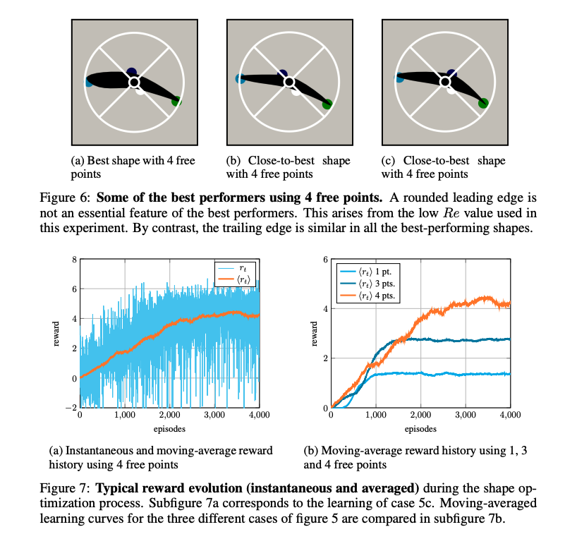
    <figcaption>Shape-control sketch: the controller proposes a geometry, the solver or surrogate evaluates lift and drag, and a DRL algorithm is trained.</figcaption>
  </figure>

  <figure>
    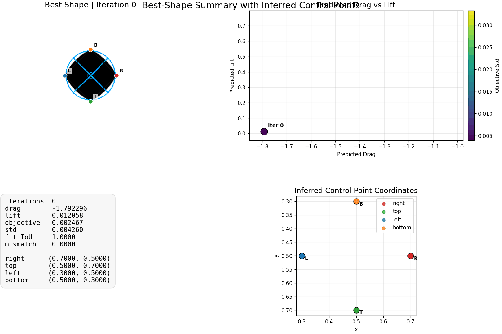
  </figure>
</div>

On the other hand, a complex GNN that predicts the velocity and pressure fields over multiple time steps and uses them to compute drag and lift doesn’t perform very well.

Now, by the time I was running the last experiments on these subjects, Codex was getting really, really good. It reached a point where most experiments were handled by Codex itself. I would provide the necessary hardware, add some markdown to describe what we did and what remained to do, and simply monitor. Which gave me an idea: maybe Codex could actually run the control-design process: decide what the next shape should be.

<figure>
  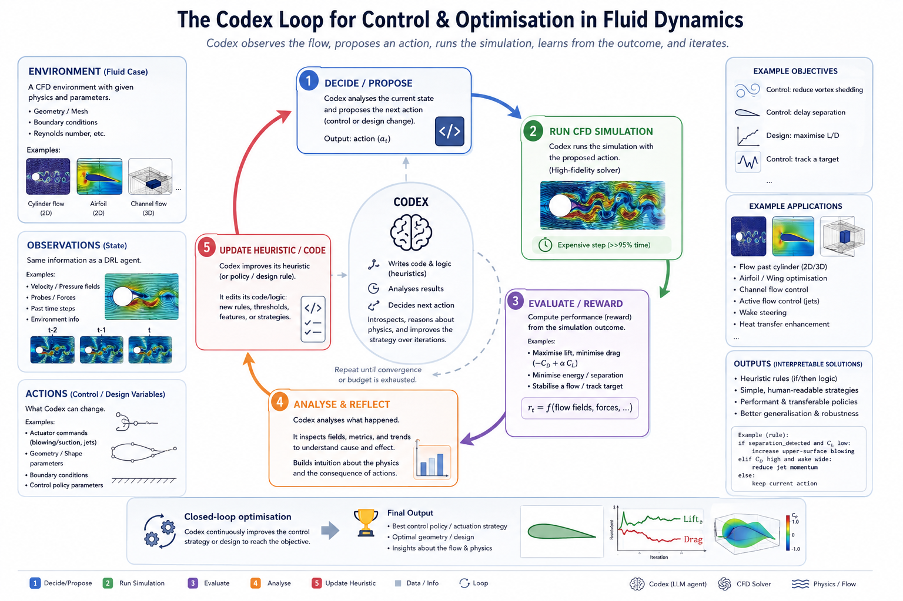
  <figcaption>Codex heuristic-learning loop: the agent writes a controller, runs fixed-seed simulations, reads the scores and diagnostics, updates its memory, then edits the next candidate policy.</figcaption>
</figure>

It turns out that instead of having Codex run the control-design process, maybe it could write the controller directly, using experiments and logic. I kept this idea on the side until I stumbled upon the blog post \sidenote{<a href="https://trinkle23897.github.io/learning-beyond-gradients/">Learning Beyond Gradients</a>}. The idea was both simple and (in my opinion) very powerful \sidenote{especially when applied to physics — where interpretability can be very important.}: while a human could not write and manage complex and powerful heuristic functions \sidenote{a function that uses logic and computation to decide what we should do: e.g., no neural networks}, an agent could totally. As a personal note, this was also a pleasant move that reminded me of my very first steps in competitive programming on Codingame.

Everything was now in place to try this idea on environments where DRL agents are usually trained for fluid dynamics: Beacon \sidenote{<a href="https://www.mdpi.com/2076-3417/14/9/3561">Beacon, a lightweight deep reinforcement learning benchmark library for flow control</a>} and FluidGym \sidenote{<a href="https://arxiv.org/abs/2601.15015">Plug-and-Play Benchmarking of Reinforcement Learning Algorithms for Large-Scale Flow Control</a>}. The concept was simple: using the same information as a DRL agent: the same observations, the same reward, and the same actions, what was possible for an agent?

We had several questions: Could Codex find interpretable heuristics (simple, rule-based strategies or decision-making procedures that can be understood by humans) for at least some cases?

1. Could such a heuristic beat some of the DRL baselines?
2. Could such heuristics be transferred from one case to a more complex one? (such as going from 2D to 3D, or from low Reynolds Number to High Reynolds Number?)
3. Does Codex create solutions that are stable outside the environmental conditions? (for a longer horizon, for example)
4. Does Codex have any understanding of the physics within the case and in its heuristic solution?
5. And finally, are some LLMs better than others for such tasks?

For those experiments, we will use several fluid cases, quite diverse both in terms of physics and complexity. For a more in-depth presentation of said cases, see Beacon \sidenote{<a href="https://www.mdpi.com/2076-3417/14/9/3561">Beacon, a lightweight deep reinforcement learning benchmark library for flow control</a>} and FluidGym \sidenote{<a href="https://arxiv.org/abs/2601.15015">Plug-and-Play Benchmarking of Reinforcement Learning Algorithms for Large-Scale Flow Control</a>}.

The cases are deliberately varied. Some are compact Beacon systems where iteration is fast. Others are heavier FluidGym simulations where each bad idea costs real wall time.

<figure>
  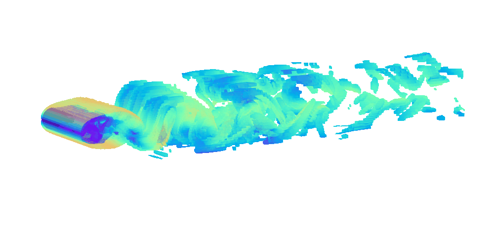
  <figcaption><strong>Cylinder.</strong> A wake-control problem behind a circular cylinder. The controller acts through jets or wall motion and tries to reduce drag, lift oscillations, or both.</figcaption>
</figure>

<figure>
  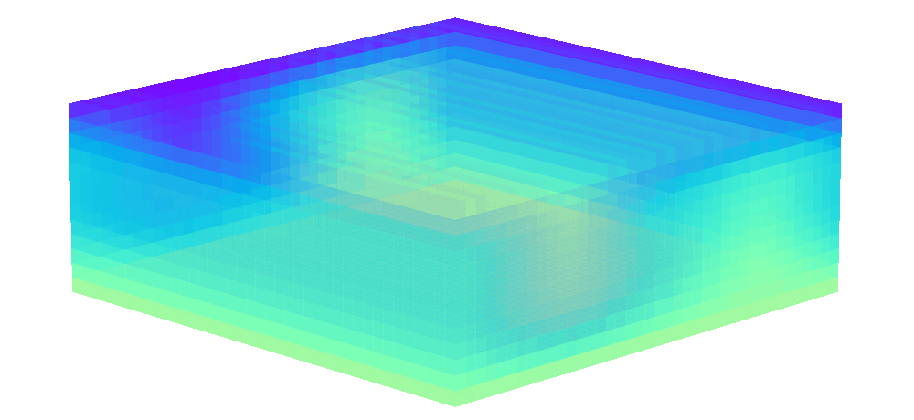
  <figcaption><strong>Rayleigh-Benard convection.</strong> A buoyancy-driven flow between hot and cold walls. The policy controls heating patterns and must manage plumes, recirculation, and heat transport.</figcaption>
</figure>

<figure>
  
  <figcaption><strong>Turbulent channel flow.</strong> A 3D wall-bounded flow where both-wall actuation is used to reduce drag. This is one of the expensive cases, and it punishes noisy control quickly.</figcaption>
</figure>

<figure>
  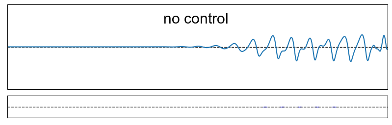
  <figcaption><strong>Shkadov falling film.</strong> A thin-film instability problem with delayed downstream effects. The controller uses jets to damp film-height disturbances before they amplify.</figcaption>
</figure>

<figure>
  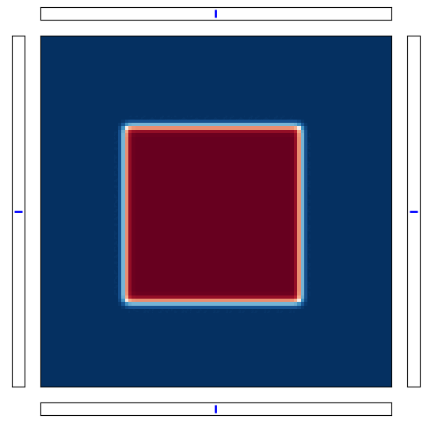
  <figcaption><strong>Mixing.</strong> A passive-scalar control task. The heuristic must stir efficiently rather than merely inject energy into the system like a confused blender.</figcaption>
</figure>

<figure>
  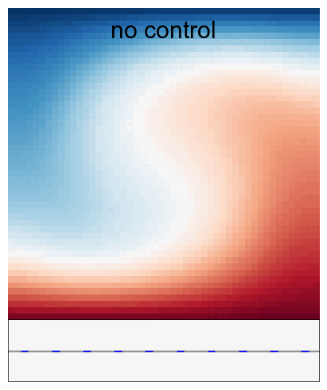
  <figcaption><strong>Rayleigh.</strong> A thermal-convection benchmark where the controller suppresses or shapes unstable transport dynamics from partial observations.</figcaption>
</figure>

<figure>
  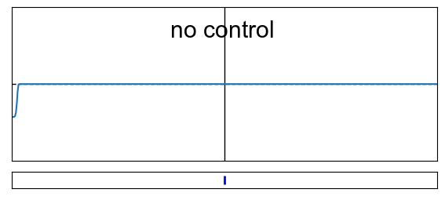
  <figcaption><strong>Burgers.</strong> A 1D nonlinear advection-diffusion system. It is small, fast, and useful for testing whether a heuristic can stabilize traveling disturbances.</figcaption>
</figure>

<figure>
  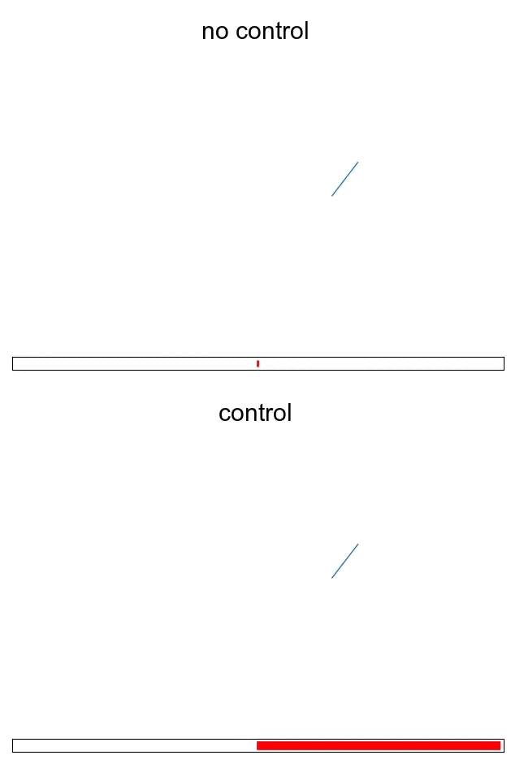
  <figcaption><strong>Lorenz.</strong> A chaotic low-dimensional system. The controller tries to shape trajectories without pretending chaos has become polite.</figcaption>
</figure>

<figure>
  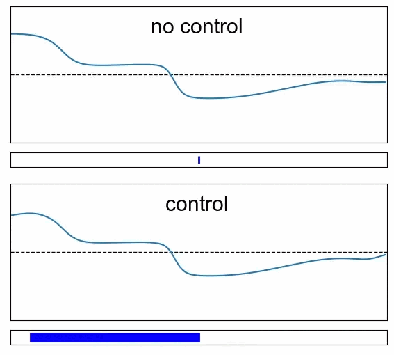
  <figcaption><strong>Sloshing.</strong> A free-surface control problem where actuation damps tank oscillations and avoids feeding energy back into the wave.</figcaption>
</figure>

<figure>
  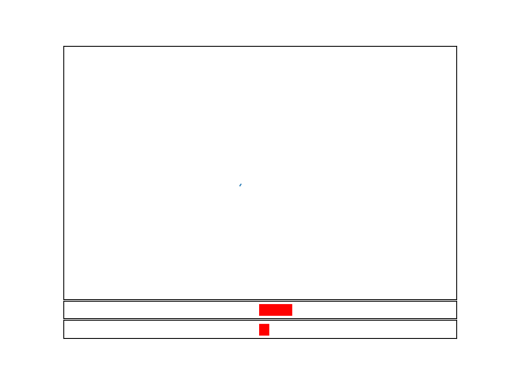
  <figcaption><strong>Vortex.</strong> A vortex-induced oscillator benchmark. The policy has to interfere with coupled flow-structure dynamics rather than chase the latest observation.</figcaption>
</figure>

We are now in a position to provide several answers to those questions! First and foremost, let’s answer the questions that don't require much analysis. Yes, Codex can find interpretable heuristics - every time! Later on, we will spend some time analyzing those solutions. Importantly, we compared Codex 5.5 and xhigh settings, Claude Opus 4.7 in xhigh settings, and Gemini 3 pro. Overall, we find that Codex > Claude > Gemini. We present below the results, as well as the DRL results, for all cases: \sidenote{We will release all markdown files and prompts very quickly!}

<figure>
  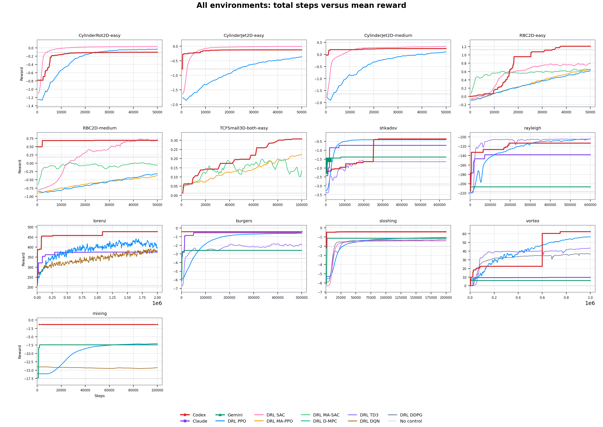
  <figcaption>Main benchmark comparison across environments and methods.</figcaption>
</figure>

We also tested to « transfer » \sidenote{i.e., make Codex not start from scratch but from a given heuristic} a heuristic from one environment to another:

* from Cylinder Easy (Re=100) to Cylinder Medium (Re = 250)
* from RBC2D Easy (Na=80,000) to RBC2D Medium (Na=400,000)
* from Shkadov with 5 jets to 10 jets

Overall, we find that the agent is able to adapt the strategy very quickly - in a much faster fashion than a DRL agent would do transfer learning / finetuning. One of the most impressive cases is the Shkadov environment, where the agent adapts the strategy almost immediately and then polishes it over a few hundred episodes. The same mechanism for a DRL agent takes much more time, and doesn’t work as well.

<figure>
  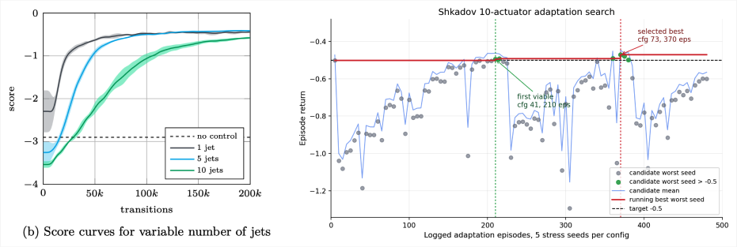
  <figcaption>Comparison between 10 jets using PPO, and using Codex to adapt a 5-jets heuristics to 10 jets.</figcaption>
</figure>

We also investigated whether the solution proposed by Codex was stable outside the « training » distribution. It is actually well known that the first solution found in Rabault’s paper was not stable outside of the studied horizon. On the other hand, other DRL approaches, such as a Soft Actor-Critic agent, were stable. Codex's solution is also stable, which is a very strong point in its favor. 

<figure>
  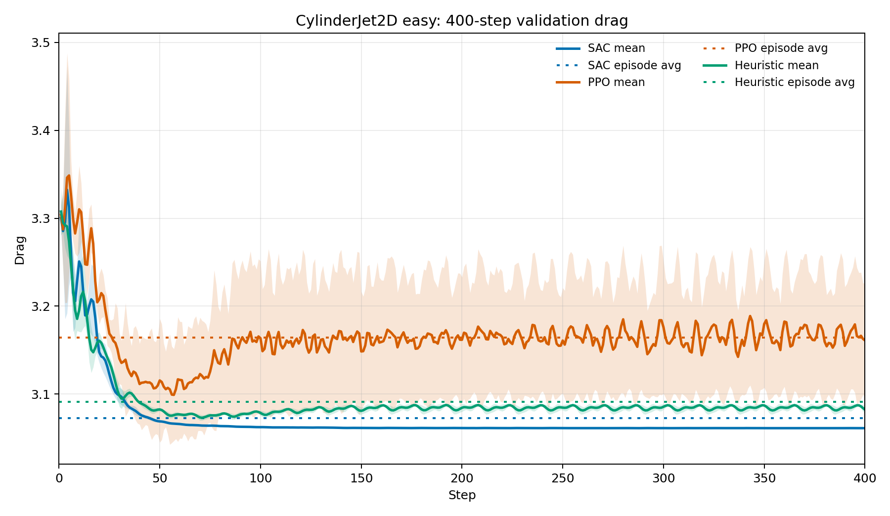
  <figcaption>Long-horizon CylinderJet2D easy validation drag for SAC, PPO, and the heuristic controller.</figcaption>
</figure>

Finally, we will spend some time dissecting the heuristics and their physical significance.


### Shkadov: delayed shape feedback

Shkadov is a falling-film problem. A thin liquid film runs downstream, small waves grow as they travel, and the controller has to use jets to stop the film-height disturbance before it becomes expensive. The difficulty lies in the timing: the controller observes upstream, while the reward cares downstream. You react immediately and the jet is early. React too late and the wave has already done the damage.

The heuristic Codex found understands that, and has a delayed shape feedback. For each actuator, it looks at the local upstream flow-rate window `q_j` and compresses it into four numbers: mean, slope, curvature, and last-point deviation.

```text
for each actuator j:
    q = upstream_flow_rate_window[j]

    mean  = average(q - 1)
    slope = q[-1] - q[0]
    curve = q[mid] - 0.5 * (q[0] + q[-1])
    last  = q[-1] - 1

    signal[j] = mean
              - 0.5847514236406733 * slope
              + 0.9217264119524546 * curve
              - 0.2278599113028571 * last

    delayed = signal_history[j][t - 11]
    raw = -0.3475132801723785 * delayed * (0.95 ** j)
          + 0.0263648075227959

    raw = clip(raw, -1, 1)
    if abs(raw) < 0.05:
        raw = 0

    action[j] = 0.16 * raw + 0.84 * previous_action[j]
```

The curvature term is doing most of the heavy lifting. That makes sense: a growing film wave is a shape problem, and curvature is the cheapest shape signal available from a short public observation window.

The delay is the most interesting part. `11` steps is a crude advective clock. The controller waits for the upstream deformation to reach the place where the jet can actually matter.

The 10-jet transfer keeps the same feature spine. Codex mainly changes the operating constants: delay `11 -> 8`, gain `0.3475 -> 0.28`, smoothing `0.84 -> 0.90`, and taper `0.95^j -> 1.03^j`. That is the kind of transfer you can audit easily.

### TCFSmall3D: local wall feedback

TCFSmall3D is a different very different. It is turbulent channel flow at `Re_tau=180`, with both walls actuated. The goal is drag reduction, so the thing that matters is wall stress and the near-wall structure feeding it.

A scalar controller is almost dead on arrival here. The flow is spatial. The wall events are spatial. If you crush the observation into one number, you throw away the coordinates of the thing you need to control. The public observation is a `(2048, 2)` wall field. Codex treats it as local wall information, conditions each wall separately, then applies one shared translation-equivariant rule. It uses public signals only, without private solver state or a wall-stress oracle in the action law.

<figure>
  <video controls muted loop playsinline width="100%" src="assets/heuristic_learning_fluid_dynamics_case_study/tcf_small_3d_both_easy__policy_rows.mp4"></video>
  <figcaption>TCFSmall3D both-wall policy replay. The heuristic keeps the action spatial instead of collapsing the wall into one global control knob.</figcaption>
</figure>

The final policy is small. Center and normalize each wall. Push against channel 1. Add a positive residual from channel 0. Smooth once on the wall grid. Remove the mean action per wall. Clip.

```text
obs = reshape(public_observation, (2048, 2))
u = obs[:, 0]
v = obs[:, 1]

for each wall in [bottom, top]:
    u[wall] = u[wall] - mean(u[wall])
    v[wall] = v[wall] - mean(v[wall])

    u[wall] = u[wall] / (std(u[wall]) + 1e-4)
    v[wall] = v[wall] / (std(v[wall]) + 1e-4)

signal = -0.263671875 * v + 0.2109375 * u

action = reshape_to_two_wall_grids(signal)
action = (4 * action
          + roll_x_plus(action)
          + roll_x_minus(action)
          + roll_z_plus(action)
          + roll_z_minus(action)) / 8

for each wall in [bottom, top]:
    action[wall] = action[wall] - mean(action[wall])

action = clip(action, -0.30, 0.30)
```

The ablations are the interesting part. Remove normalization and the score collapses toward `0.02-0.05`. Remove the positive channel-0 residual and the family drops hard. Flip the top-wall sign and it breaks. Replace the wall field with scalar wall-stress feedback and it gets worse.

That is the physics sneaking through the code. The controller works because it keeps the geometry alive. It acts like a local wall law; the global metronome versions failed.

<figure>
  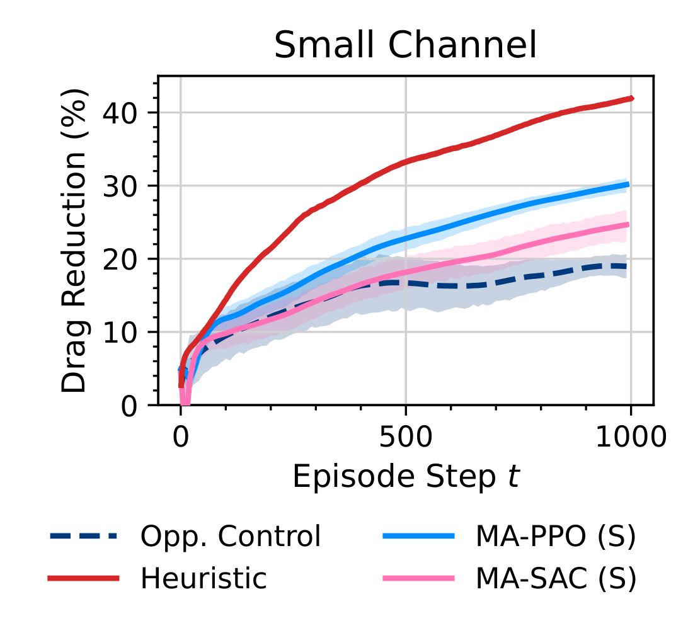
  <figcaption>TCFSmall3D drag reduction under the final heuristic. The selected rule reaches about `30.26%` mean drag reduction on the diagnostic episode, with a final value around `41.93%`.</figcaption>
</figure>

## Conclusion

We are keeping some final experiments and studying the wall time and token costs for later. However, we want to conclude this article with several points. First, it is astonishing to see an AI now able to perform tasks for quite a long time (sometimes more than 24 hours in some complex 3D cases). Second, it is even more impressive to see the same AI digest a physical simulation, understand what is happening, and interact with it as efficiently as possible. I actually believe that this could pave the way for (i) much more complex cases, and (ii) for agents even more embedded in our system. One of the last DRL applications in my lab was selecting the best stent-control strategy for Brain Aneurysm Surgery \sidenote{<a href="https://www.nature.com/articles/s41598-023-34007-z">Patient-specific stenting control paper</a>}. One could now imagine an agent being able to query data of multiple types (physiological data, meshes, aneurysm parameters, fluid simulation, stent configurations), and act as a virtual surgeon, operating on a patient in a simulated environment, studying what is happening, and refining its control procedure. This will obviously take quite some time, but we are getting there, and this sounds great for patients and medicine in general.
